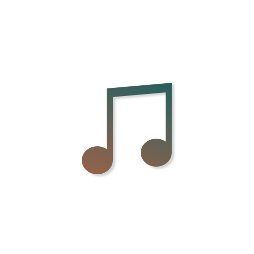

# Melodica

A music bot written for fun and personal use over the years, with a focus on audio quality. 

As of writing it has full support for YouTube, Spotify and experimental support for SoundCloud.

Extra features currently include a lyrics and wikipedia service.
